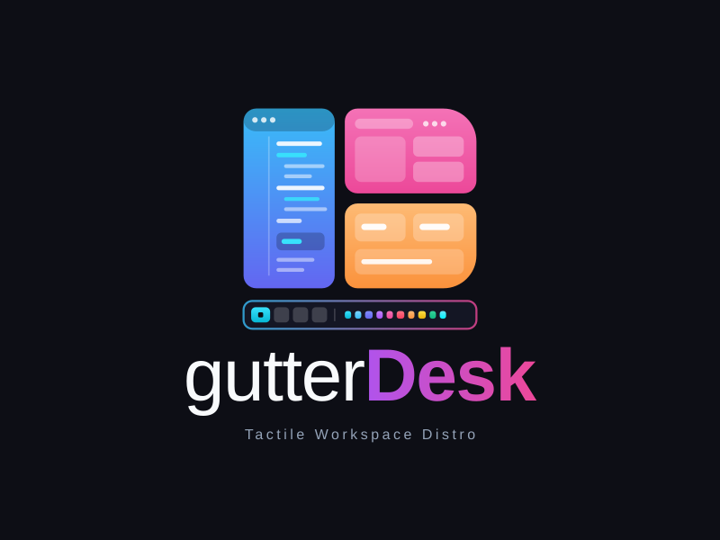

<div align="center">
  
  <p><strong>The Tactile, Edge-Driven Productivity Suite &amp; Desktop Linux Distro</strong></p>
  <p>Built on Debian 13 (Trixie) · Openbox · Tint2 · Direct Atomic Dotfiles · Modular Capability Engine</p>
</div>

---

## Overview

**gutterDesk** is a reproducible, minimalist Linux distribution designed for keyboard-driven productivity and software engineering. It serves as the operating system foundation for the **gutter** productivity family, integrating **gutterDeck** (edge-anchored application dock) and **gutterTab** (edge-docked notes, prompt templates, and directory bookmarks) directly into the X11 desktop environment.

### Core Architecture & Highlights
* **Universal Base Core:** Boots to an ultra-lightweight environment consuming **<400 MB idle RAM** with 0% idle CPU overhead.
* **Midnight Forest Theme:** Bespoke obsidian dark aesthetic (`#060d08` base) with deep pine accents and sage text highlights (`#629e79`), paired with Papirus-Dark icons.
* **Integrated Productivity Suite:** Native desktop entries and binaries for **Antigravity IDE**, **gutterDeck**, and **gutterTab**.
* **Modern Wireless Stack:** Powered by Intel Wireless Daemon (`iwd`), `iwgtk` Wi-Fi management, and a zero-daemon native `tint2` network executor (`tint2-network.sh`) displaying live signal strength.
* **Lightweight Login & Lock:** Seamless LightDM login greeter unified with `light-locker` (identical obsidian theme across boot, login, and screen lock, avoiding `xscreensaver`).
* **Dual-Monitor Smart Wallpapers:** Automatically detects portrait and landscape display heads (`auto-wallpaper.sh`) and assigns orientation-matched obsidian wallpapers.
* **Direct Atomic Symlinks:** Dotfiles deploy cleanly via direct atomic symlinks (`ln -sf`), eliminating configuration drift without external manager overhead.
* **Modular Capability Engine:** An interactive post-install selector (`./install.sh`) provisions Creative, Media, Web, or Trading stacks on demand.

---

## Quickstart & Installation

### 1. Minimal Debian 13 Base Install
Start with an official **Debian 13 (Trixie) Minimal Netinst ISO** (`amd64`).
* **Root Password**: Leave **empty / blank** during installer prompt. Debian will disable the root account and automatically grant full `sudo` privileges to your user.
* In `tasksel`, uncheck all desktop environments and check only:
  * `[*] SSH server`
  * `[*] standard system utilities`

### 2. First Boot & Bootstrap
Log in with your normal user account and bootstrap the system:
```bash
sudo apt update && sudo apt install -y git
git clone https://github.com/aimasri/gutterDesk.git ~/gutterDesk
cd ~/gutterDesk
sudo ./bootstrap.sh
sudo reboot
```

### 3. Connect Machine Identity & Private Profiles (Optional)
If migrating from a backup, extract your private profile into `~/gutterDesk/backup/` and connect your SSH keys and desktop state:
```bash
mkdir -p ~/gutterDesk/backup
tar -xzf /path/to/gutterdesk-private-backup.tar.gz -C ~/gutterDesk/backup/ --strip-components=1
cd ~/gutterDesk/backup && ./connect.sh
```

### 4. Enable Functional Modules (Optional)
Once booted into the graphical desktop, launch the interactive module installer:
```bash
cd ~/gutterDesk
./install.sh
```

### 5. Hydrate Cloned Projects (Optional)
Once you clone your repositories (or mount them from your central host), inject their environment credentials:
```bash
cd ~/gutterDesk/backup && ./sync.sh
```

---

## The gutter Productivity Family

| Component | Role | Description |
| :--- | :--- | :--- |
| **[gutterDesk](https://github.com/aimasri/gutterDesk)** | Desktop Operating System | Minimalist, reproducible Debian 13 distribution with Openbox + Tint2. |
| **[gutterDeck](https://github.com/aimasri/gutterDeck)** | Desktop Compositor Dock | 10-channel edge accordion dock for instant application launching. |
| **[gutterTab](https://github.com/aimasri/gutterTab)** | Edge Note &amp; Prompt Daemon | Edge-docked note drawer with prompt templates and directory bookmarks. |

---

## Repository Structure

```
gutterDesk/
├── bootstrap.sh                 # Staged orchestrator executing core/00 through core/07
├── install.sh                   # Interactive architectural role & capability installer
├── docs/                        # Centralized Distro Documentation Suite
│   ├── AGENTS.md                # AI Agent & engineering protocols (cluster safety)
│   ├── ARCHITECTURE.md          # 2-tier topology, resilient NFSv4 & OS design
│   ├── HARDWARE_POWER.md        # Battery threshold, lid switch & screen rotator
│   ├── DESKTOP_ENVIRONMENT.md   # Openbox, Tint2, Picom, Midnight Forest & menus
│   ├── MODULES.md               # Capability module catalog & specifications
│   └── RUNBOOK.md               # Bare-metal setup, cluster sync & troubleshooting
├── core/                        # Staged Modular Bootstrap Engine
│   ├── 00-repos.sh              # Debian online mirrors & GPG keyrings
│   ├── 01-base-packages.sh      # Universal Base packages (Openbox, Tint2, iwd)
│   ├── 02-themes-branding.sh    # Wallpapers, GTK, icons & desktop entries
│   ├── 03-boot-login.sh         # Plymouth boot splash, GRUB & LightDM greeter
│   ├── 04-network-iwd.sh        # Modern wireless stack (iwd + iwgtk) migration
│   ├── 05-dotfiles.sh           # Pure declarative dotfiles atomic symlinking
│   ├── 06-desktop-tools.sh      # Utilities, gutter family & Antigravity suite
│   └── 07-hardware-power.sh     # Lid switch, battery threshold & permissions
├── bin/                         # Centralized Distro System & User Utilities
│   ├── gutterdesk-menu          # Modular Openbox menu compiler & toggler
│   ├── gutterdesk-rotator       # Accelerometer & touchscreen orientation daemon
│   ├── auto-wallpaper.sh        # Multi-head orientation-matched wallpaper engine
│   ├── tint2-network.sh         # Zero-overhead live Wi-Fi telemetry executor
│   └── gutterdesk-first-run.sh  # First-boot interactive setup assistant
├── dotfiles/                    # Pure Declarative Configuration Hierarchies
│   ├── openbox/                 # Window manager configs (menu.template.xml, menu.d/, rc.xml, autostart)
│   ├── tint2/                   # Status bar configuration (tint2rc)
│   ├── iwgtk/                   # Wi-Fi indicator obsidian theme config
│   ├── pcmanfm/                 # Dual-pane file manager layout & bookmarks
│   └── ...                      # GTK, Guake, volumeicon, and gsimplecal dotfiles
├── modules/                     # Standardized Capability Modules
│   ├── module-creative.sh       # Digital illustration, 3D and video toolchains
│   ├── module-banyan-engine.sh  # Wine64, MT5, Python bridge & headless daemon
│   ├── module-banyan-dashboard.sh # C++/Qt6 desktop telemetry UI
│   ├── module-media-tailscale.sh # Jellyfin transcoding & WireGuard mesh node
│   ├── module-webstack.sh       # Apache2, PostgreSQL, Redis & vhosts
│   ├── module-torrent.sh        # Transmission daemon & UFW firewall
│   ├── module-nfs-server.sh     # Hardened NFSv4-only pseudo-root export
│   └── module-nfs-client.sh     # Resilient systemd on-demand automount
├── packages/                    # Declarative package lists (base, creative, web, etc.)
├── scripts/                     # Asset and wallpaper generation utilities
├── themes/                      # LightDM login greeter and Plymouth boot splash themes
└── wallpapers/                  # Dynamic landscape and portrait wallpapers
```

---

## System Shortcuts

| Shortcut | Action |
| :--- | :--- |
| `F12` | Toggle Guake dropdown terminal |
| `Alt + F2` | Run Program dialog (`gmrun`) |
| `Super + Space` | Open root desktop menu |
| `Super + x` | Session &amp; Power menu (Log Out, Reboot, Power Off) |
| `PrintScreen` | Full screen screenshot (`scrot`) |
| `Alt + PrintScreen` | Active window screenshot (`scrot -u`) |
| `Shift + PrintScreen` | Interactive select area (`scrot -s`) |

---

## License
MIT License. Open for modification and community deployment.
